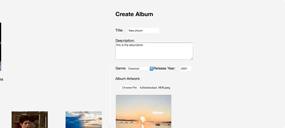
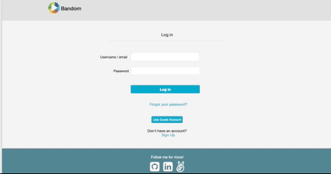

# Bandom

[Live Link!](https://bandom.herokuapp.com/#/login)

Bandom is a full-stack web application inspired by Bandcamp, a music-sharing
website and marketplace for more local and lesser-known underground artists.
Bandom uses Ruby on Rails and a PostgreSQL database on the backend
and a React-Redux framework on the frontend.

## Features

### 1. Artist & Album Show Pages

- Users can view other artist's pages that display all of the artist's discography and background information. On an album page, users can view the full information for a specific album, including title, genre, description, release year and its full track list. An album page also has a link to its artist's page and an artist page has links to each of its album's pages.

### 2. Song Player

- Users can preview and play through tracks in album show page and can download a track to their computer.

### 3. Album Creation and Deletion

- Using a form on the "add music" page, users can create their own albums and add them to the Bandom index for all users to enjoy streaming and downloading. The album creation requires a title, genre, description, release year and at least one track, and has an optional album artwork uploading section. Users also have the option to delete their own albums using a button found on each of their album's respective show pages.

### 4. Search Bar

- Users can search for a track, artist or album with results that display and update in real-time based on three separate client-side pattern-matching functions that simply filter and return results from data already in the state, thus saving on slow and costly database calls. For a more intuitive UI, search results for artists have their pictures in a circular frame, artworks for album search results have square framing, and track search results have a blue music note icon beside them.

### 5. User Profile Editing

- In the user profile page found under the user's username link in the nav bar, users have the ability to set and change their artist profile picture and can also set their hometown/location to any city in the world using Google Maps Places API.

### 6. User Authentication

- The user authentication features login and sign up options in separate forms as well as links to these pages while browsing, including a signup modal that redirects to the sign up form. In the login form, there is also a guest login option with a button that when clicked, displays an animated self-typing login of a guest user.

## Future Plans

In addition to the features already implemented, I plan to continue improving and adding additional features to this project. The next steps for Bandom are outlined below:

- Browse by Genre section on Landing page

- Recently Downloaded section on Landing page

- Editing tracks and albums in a user's own collection

- Follows: Allowing users to follow each other and artist pages

- Large-scale Playback: Bigger Viewer of current song that's playing, with album art as background.

- Favorites: Users can favorite each other's collections and access them in their Favorite Collections

## Credits

* Code by: Max Currier
* Demo Login Animation: [Typed.js](https://github.com/mattboldt/typed.js/) by Matt Boldt
* Autocompleting Places Search: [React Places Autocomplete](https://github.com/kenny-hibino/react-places-autocomplete), a React component to build a customized UI for Google Maps Places Autocomplete by Kenny Hibino
* Places Search Data: [Google Maps Places API](https://developers.google.com/places/web-service/autocomplete)
